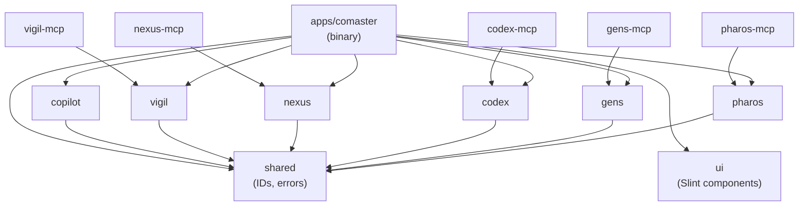
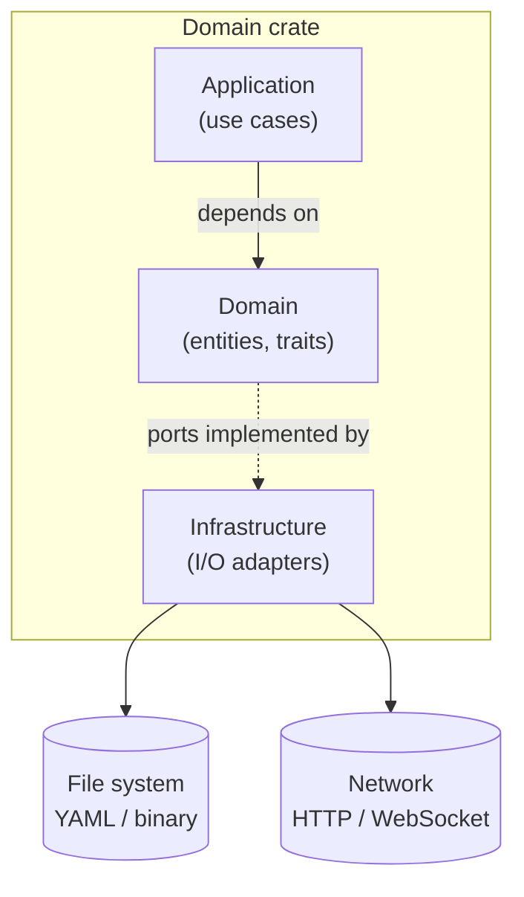
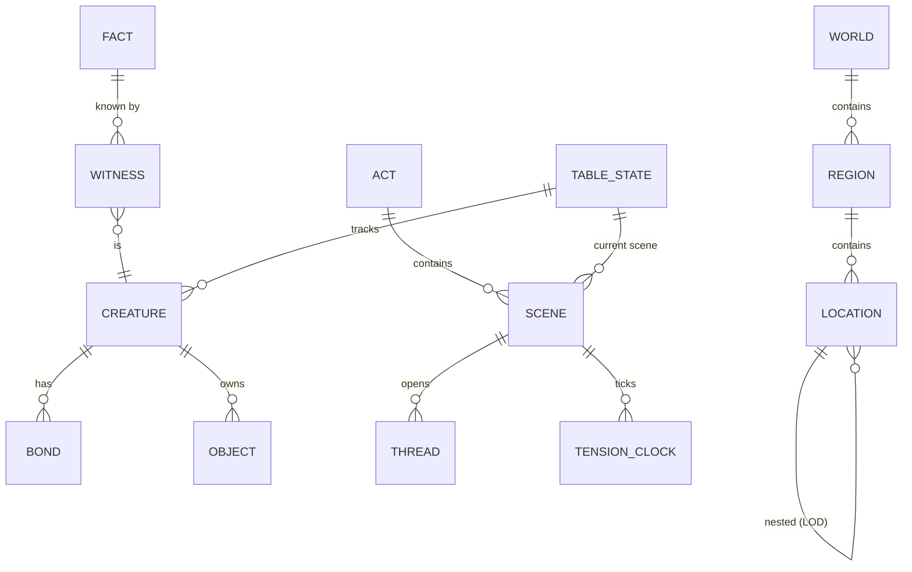
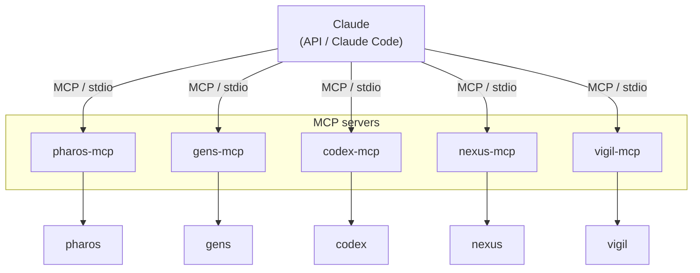
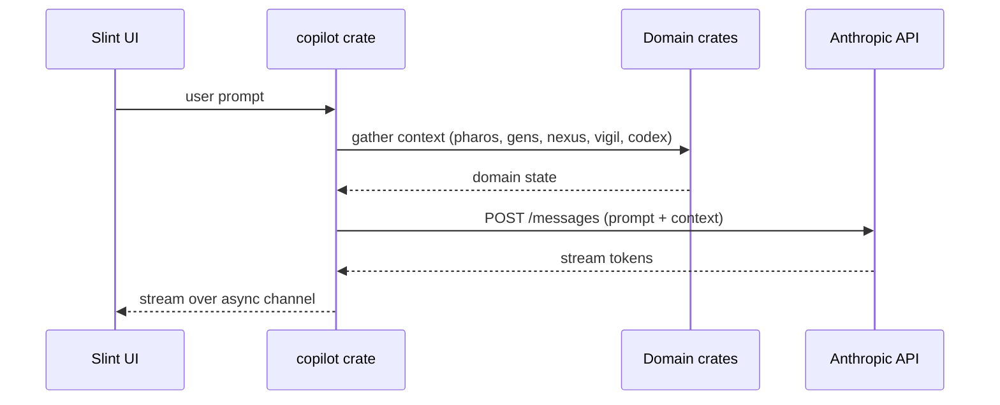
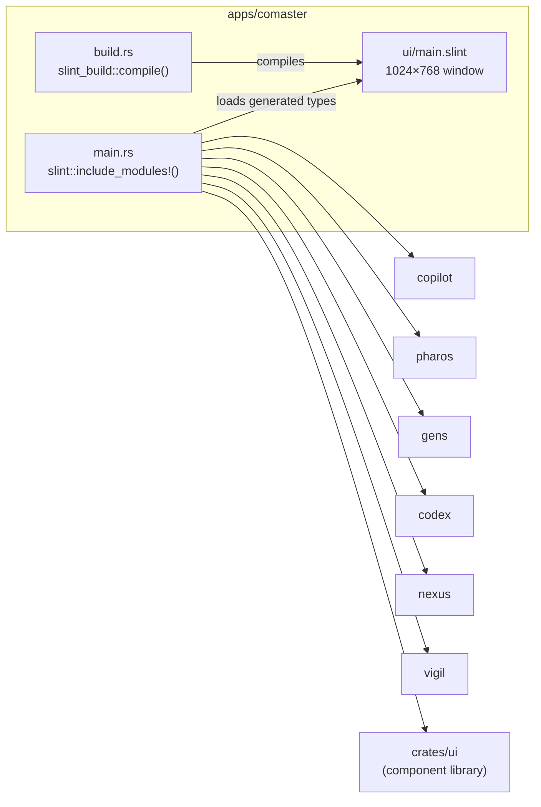
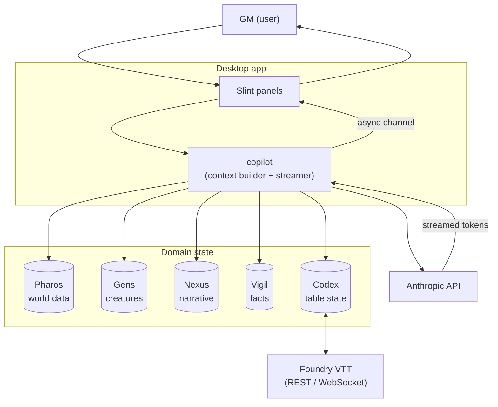

# Comaster — Architecture

Comaster is a desktop GM assistant and fiction-world authoring environment written in Rust and Slint. It integrates five domain-specific knowledge models, an AI co-pilot (Claude), and a Foundry VTT adapter, exposed both as a native desktop application and as MCP servers.

---

## Workspace layout

The repository is a Cargo workspace with a strict separation between reusable domain crates and the application binary.

```
comaster/
├── apps/
│   └── comaster/          ← Desktop application (binary)
├── crates/
│   ├── shared/            ← Cross-cutting IDs and error types
│   ├── pharos/            ← Domain: world geography & LOD
│   ├── pharos-mcp/        ← MCP server for Pharos
│   ├── gens/              ← Domain: creatures, objects, bonds
│   ├── gens-mcp/
│   ├── codex/             ← Domain: Foundry VTT adapter + YZE rules
│   ├── codex-mcp/
│   ├── nexus/             ← Domain: narrative structure
│   ├── nexus-mcp/
│   ├── vigil/             ← Domain: knowledge & witness register
│   ├── vigil-mcp/
│   ├── copilot/           ← AI co-pilot orchestration (Claude)
│   └── ui/                ← Reusable Slint components
├── docs/
└── worlds/                ← World data (YAML / binary, gitignored)
```

---

## Crate dependency graph



> **Rule:** Domain crates depend only on `shared`. No cross-domain imports. Infrastructure is the only layer that performs I/O.

---

## Hexagonal architecture (DDD)

Each domain crate (`pharos`, `gens`, `codex`, `nexus`, `vigil`) follows the same three-layer structure:

```
crates/<domain>/src/
├── lib.rs
├── domain/          ← Entities, value objects, invariants, repository traits
├── application/     ← Use cases; depends only on domain
└── infrastructure/  ← Repository implementations, I/O adapters
```



**Invariant:** The domain layer has zero I/O dependencies. Application orchestrates domain objects through ports (traits). Infrastructure is the only place where external systems are touched.

### Layer responsibilities per domain

| Crate | Domain models | Application use cases | Infrastructure |
|---|---|---|---|
| **Pharos** | World, Region, Location, LOD hierarchy | Query geography, resolve nested detail | FS repos (YAML/binary), optional OSM adapter |
| **Gens** | Creature, Object, Bond, NPC voice | Create / retrieve entities, project voice | FS repos (YAML/binary) |
| **Codex** | Table state, YZE rule abstractions | Query Foundry, apply rules, resolve rolls | Foundry HTTP/WebSocket client |
| **Nexus** | Act, Scene, Thread, Tension clock | Author narrative, advance clocks | FS repos (YAML/binary) |
| **Vigil** | Fact, Witness, append-only register | Assert facts, resolve knowledge | Append-only log / event-store adapter |

---

## Domain model overview



---

## MCP server architecture

Each domain crate publishes a paired MCP server binary (`<domain>-mcp`). Claude (via Claude Code or the API) connects to any combination of these servers over the Model Context Protocol.



Every MCP server follows the same skeleton:

```rust
#[tokio::main]
async fn main() {
    tracing_subscriber::fmt::init();
    // rmcp handler wired to domain crate
}
```

Runtime: **tokio** (full). Protocol: **rmcp 1.7**.

---

## AI co-pilot (Copilot crate)

`crates/copilot` is the orchestration layer that drives the in-app Claude integration. It is separate from the MCP servers — it talks to the Anthropic REST API directly from within the desktop process.



> There is no official Anthropic Rust SDK; `copilot` uses `reqwest` against the REST API directly.

---

## Desktop application (apps/comaster)

The binary integrates all domain crates and drives the Slint window.



`.slint` files are compiled to Rust types at build time by `slint-build`. The UI components library (`crates/ui`) provides shared widgets reused across panels.

---

## Tech stack

| Layer | Technology | Version | Role |
|---|---|---|---|
| Language | Rust | 2024 edition | Everything |
| UI framework | Slint | 1.16 | Native desktop rendering |
| MCP SDK | rmcp | 1.7 | Model Context Protocol servers |
| Async runtime | tokio | 1 (full) | All async I/O |
| HTTP client | reqwest | 0.13 | Anthropic API + Foundry VTT |
| Serialization | serde + yaml_serde | 1 / 0.10 | Domain persistence (YAML) |
| Error handling | anyhow + thiserror | 1 / 2 | Boundary errors + domain errors |
| CLI parsing | clap | 4 (derive) | MCP server CLI flags |
| Logging | tracing + tracing-subscriber | 0.1 / 0.3 | Structured logs, env-filter |
| Task runner | just | — | `just build`, `just run-mcp pharos`, … |
| Version control | Git + GitHub | — | `gh repo: pedro/comaster` |
| Issue tracking | YouTrack | cloud | Project: CM (`denczh.youtrack.cloud`) |

---

## Data flow: session runtime



---

## Key architectural decisions

| Decision | Rationale |
|---|---|
| One MCP server per domain | Claude can be given exactly the context it needs per task; avoids a monolithic server |
| Hexagonal + DDD per crate | Domain logic is testable in isolation; infrastructure swappable without touching domain |
| `shared` crate for IDs | Prevents newtype duplication and cross-crate circular dependencies |
| `copilot` separate from domain crates | AI orchestration is an application concern, not part of any domain model |
| Slint for UI | Compiled, native, cross-platform (Windows/macOS/Linux); no Electron/WebView overhead |
| `reqwest` instead of SDK | No official Anthropic Rust SDK exists; direct REST keeps the dependency surface small |
| Vigil append-only | Knowledge in a fiction world is never truly retracted — facts are superseded, not deleted |
| YAML for persistence | Human-readable and editable outside the app; worlds are author artifacts |
